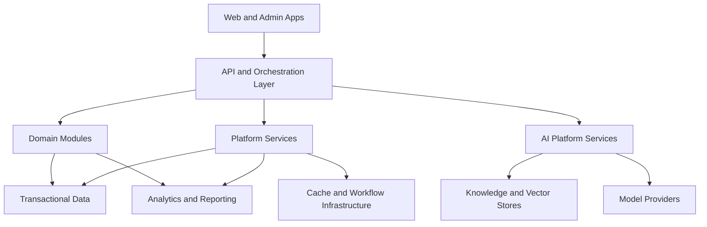

# Architecture

## Purpose

This document defines the target system architecture for the platform and explains how business modules, platform services, AI infrastructure, and data systems should fit together over time.

## Scope

This document covers:
- architectural style
- system layers
- logical component relationships
- scaling and resilience direction
- implementation guidance for future phases

This document does not cover:
- provider-specific infrastructure manifests
- network diagrams at deployment detail level
- framework bootstrapping

## Architectural Objectives

- Support modular product growth without runaway coupling
- Preserve shared customer context across lifecycle modules
- centralize cross-cutting concerns such as audit, configuration, and AI routing
- enable future scale without forcing early microservice complexity
- maintain strong multi-tenant and security boundaries

## Architectural Style

The recommended starting architecture is a **modular monolith with event-oriented boundaries**, managed inside a monorepo.

This is preferred because:
- early coordination across shared modules is easier
- operational complexity is lower
- code reuse is more straightforward
- extraction into dedicated services remains possible later

## System Layers

### Experience Layer

- operator-facing web application
- administrative and governance interfaces
- future external or partner-facing experiences as needed

### Application Layer

- request orchestration
- command and query handling
- workflow initiation
- tenant and actor context propagation

### Domain Layer

- CRM core concepts
- revenue and marketing modules
- partner and reseller modules
- support, onboarding, training, and success modules

### Platform Layer

- identity and access
- configuration
- audit
- workflow orchestration
- notifications
- search and analytics support

### AI Platform Layer

- AI Gateway
- Prompt Registry
- Agent Registry
- retrieval orchestration
- evaluation and safety services

### Data Layer

- transactional data store
- cache and queue infrastructure
- object storage
- vector and search indexes
- analytics and reporting storage

## Logical Architecture

## Architectural Boundaries

### Product Modules

Product modules should own business workflows and lifecycle semantics, but they should not reimplement platform concerns such as audit, AI routing, or tenant context propagation.

### Platform Services

Platform services should provide reusable capabilities that every module can depend on:
- authorization
- audit
- configuration
- automation
- observability

### AI Services

AI services should be centrally governed and consumed through contracts. Product teams should not create direct provider coupling in their modules.

## Integration Patterns

### Synchronous Paths

Use synchronous interactions for:
- user-driven create, read, update, and review operations
- low-latency AI interactions where appropriate
- configuration and administrative flows

### Asynchronous Paths

Use asynchronous processing for:
- workflow automation
- ingestion and indexing
- analytics event processing
- long-running AI or batch tasks

## Resilience and Scalability Direction

- scale stateless request-serving components horizontally
- isolate long-running workloads in workers
- partition search, vector, and analytics workloads from primary transactional flows
- preserve graceful degradation when external AI providers or async systems fail

## Observability Expectations

- structured logs for important business and technical events
- traceability across user actions, workflows, and AI requests
- metrics for module usage, failures, latency, and queue health
- audit visibility for sensitive actions

## Implementation Guidance

When implementation begins:
- establish clear module boundaries before adding feature depth
- create platform interfaces for audit, config, workflow, and AI access
- document every cross-module dependency that affects lifecycle continuity
- prefer evolutionary architecture over premature distribution
- keep architecture docs updated when boundaries or control flows change

## Phase 0 Note

This architecture is directional. The repository does not yet contain services or runtime implementation.
