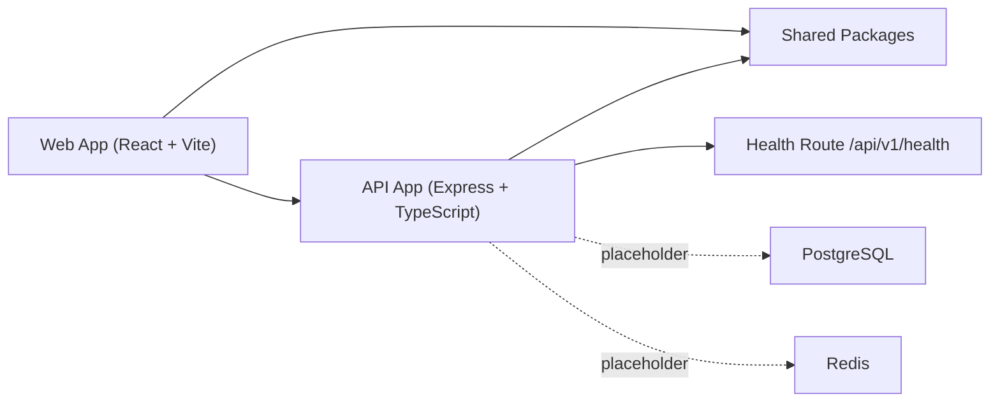

# Architecture

## Purpose

This document describes the current architectural baseline after Phase 1 and explains how the initialized frontend, API, shared packages, and future platform layers fit together.

## Scope

This document covers:
- current implemented architecture
- application boundaries
- shared package responsibilities
- near-term extensibility direction
- implementation guidance

This document does not cover:
- infrastructure deployment topology
- final service decomposition
- domain module internals

## Phase 1 Architectural State

The system is currently a monorepo with two runnable application entry points:
- `apps/web`
- `apps/api`

The architecture is intentionally lightweight but structured so future modules can grow without rewriting the application frame.

## Architecture Style

The current implementation follows a **modular monorepo** with:
- a frontend application shell
- an API composition layer
- shared foundational packages

This keeps operational overhead low while preserving clear seams for later extraction.

## Implemented System View

## Implemented Layers

### Experience Layer

Currently implemented in `apps/web`:
- route composition
- responsive shell
- placeholder module pages
- theme foundation

### API Layer

Currently implemented in `apps/api`:
- server bootstrap
- middleware stack
- versioned routing
- health endpoint
- error handling

### Shared Foundation Layer

Currently implemented in `packages/*`:
- shared types
- shared config
- shared UI tokens
- auth placeholder metadata
- AI placeholder metadata
- database placeholder contracts

## Frontend Boundary

The frontend currently owns:
- navigation and information architecture
- layout and visual system foundation
- placeholder page surfaces for future modules

The frontend currently does not own:
- business logic
- authentication
- live API state
- form workflows

## API Boundary

The API currently owns:
- request lifecycle composition
- health visibility
- runtime configuration parsing
- logging and error response behavior

The API currently does not own:
- business-domain modules
- persistence
- queues
- AI runtime orchestration
- auth or tenant resolution

## Shared Package Boundary

Shared packages are intentionally thin in Phase 1. Their purpose is to establish reusable seams before module logic begins.

This matters because future phases should not:
- duplicate shared types between the web and API
- scatter API version constants across code
- hard-code UI layout values in multiple places
- mix placeholder infrastructure contracts directly into business modules

## Route and Versioning Structure

### Frontend routes

Implemented routes include:
- `/login`
- `/dashboard`
- `/admin`
- `/leads`
- `/accounts`
- `/opportunities`
- `/campaigns`
- `/support`
- `/customer-success`
- `/ai-assistant`

### API routes

Implemented routes include:
- `/`
- `/api/v1`
- `/api/v1/health`

## Extensibility Direction

### Frontend

Future phases should add:
- auth-aware route guards
- data loaders or service clients
- module-specific components and state
- reusable table, form, and detail patterns

### API

Future phases should add:
- domain module routers
- service layer boundaries
- persistence adapters
- auth and tenant middleware
- workflow and AI platform integration

## Architectural Risks Being Avoided

Phase 1 deliberately avoids:
- immediate microservice sprawl
- feature-local direct model integrations
- routing without versioning
- UI pages without a reusable shell
- backend growth without centralized error handling and env validation

## Implementation Guidance

The next phase should preserve these architectural constraints:
- all new API modules should mount under `/api/v1`
- all new frontend feature areas should fit into the shared shell unless intentionally public
- shared types should move into packages before duplication appears
- auth and tenancy should be introduced as platform capabilities, not page-by-page patches

## Phase 1 Note

This document reflects the current implemented system frame. It is no longer purely directional, but it still represents foundation work rather than full platform behavior.
